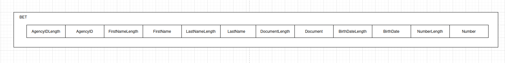
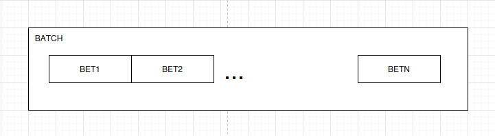

# TP0: Docker + Comunicaciones + Concurrencia

Alumno: Juan Ignacio Giacobbe
Padron: 109866
Fecha de Entrega: 27/03/2025

## Instrucciones de uso
El repositorio cuenta con un **Makefile** que incluye distintos comandos en forma de targets. Los targets se ejecutan mediante la invocación de:  **make \<target\>**. Los target imprescindibles para iniciar y detener el sistema son **docker-compose-up** y **docker-compose-down**, siendo los restantes targets de utilidad para el proceso de depuración.

Los targets disponibles son:

| target  | accion  |
|---|---|
|  `docker-compose-up`  | Inicializa el ambiente de desarrollo. Construye las imágenes del cliente y el servidor, inicializa los recursos a utilizar (volúmenes, redes, etc) e inicia los propios containers. |
| `docker-compose-down`  | Ejecuta `docker-compose stop` para detener los containers asociados al compose y luego  `docker-compose down` para destruir todos los recursos asociados al proyecto que fueron inicializados. Se recomienda ejecutar este comando al finalizar cada ejecución para evitar que el disco de la máquina host se llene de versiones de desarrollo y recursos sin liberar. |
|  `docker-compose-logs` | Permite ver los logs actuales del proyecto. Acompañar con `grep` para lograr ver mensajes de una aplicación específica dentro del compose. |
| `docker-image`  | Construye las imágenes a ser utilizadas tanto en el servidor como en el cliente. Este target es utilizado por **docker-compose-up**, por lo cual se lo puede utilizar para probar nuevos cambios en las imágenes antes de arrancar el proyecto. |
| `build` | Compila la aplicación cliente para ejecución en el _host_ en lugar de en Docker. De este modo la compilación es mucho más veloz, pero requiere contar con todo el entorno de Golang y Python instalados en la máquina _host_. |


## Parte 1: Introducción a Docker
En esta primera parte del trabajo práctico se plantean una serie de ejercicios que sirven para introducir las herramientas básicas de Docker que se utilizarán a lo largo de la materia. El entendimiento de las mismas será crucial para el desarrollo de los próximos TPs.

### Ejercicio N°1:
Definir un script de bash `generar-compose.sh` que permita crear una definición de Docker Compose con una cantidad configurable de clientes.  El nombre de los containers deberá seguir el formato propuesto: client1, client2, client3, etc. 

El script deberá ubicarse en la raíz del proyecto y recibirá por parámetro el nombre del archivo de salida y la cantidad de clientes esperados:

`./generar-compose.sh docker-compose-dev.yaml 5`

Considerar que en el contenido del script pueden invocar un subscript de Go o Python:

```
#!/bin/bash
echo "Nombre del archivo de salida: $1"
echo "Cantidad de clientes: $2"
python3 mi-generador.py $1 $2
```

En el archivo de Docker Compose de salida se pueden definir volúmenes, variables de entorno y redes con libertad, pero recordar actualizar este script cuando se modifiquen tales definiciones en los sucesivos ejercicios.

### Resolución del Ejercicio 1

En un principio se generó el script `generar-compose.sh`, ubicado en el root del proyecto. Este script invoca a un subscript de Python llamado `clients-generator.py`, el cual también se encuentra en el root del proyecto.

Para poder ejecutar el script del ejercicio, primero se debe hacer ejecutable corriendo el siguiente comando:

```bash
chmod +x generar-compose.sh
```

Luego, se debe ejecutar el script con el siguiente usage:

```bash
./generar-compose.sh <output-file> <clients-number>
```

Este script generará un docker-compose con una cantidad n de clientes. En caso de no cumplir con el usage, se devolverá un error.

#### Generación de Docker Compose:

El script en Python (`clients-generator.py`) genera el archivo de Docker Compose con el siguiente formato:

- Un servicio para el servidor (server).
- Varios servicios para los clientes (client1, client2, ..., clientN).
- Cada cliente tendrá configuraciones de entorno y estará conectado a una red llamada testing_net.
- El servidor y los clientes están configurados para depender unos de otros (usando depends_on).

El archivo de salida generado contendrá la definición de Docker Compose que podrá ser utilizada para ejecutar el servidor y los clientes configurados en contenedores Docker.

---

### Ejercicio N°2:
Modificar el cliente y el servidor para lograr que realizar cambios en el archivo de configuración no requiera reconstruír las imágenes de Docker para que los mismos sean efectivos. La configuración a través del archivo correspondiente (`config.ini` y `config.yaml`, dependiendo de la aplicación) debe ser inyectada en el container y persistida por fuera de la imagen (hint: `docker volumes`).

### Resolución del Ejercicio 2

Se modificaron tanto el cliente como el servidor para lograr que los cambios en los archivos de configuración no requieran reconstruir las imágenes de Docker para que los mismos sean efectivos. Los archivos de configuración (`config.ini` para el servidor y `config.yaml` para el cliente) son ahora inyectados en los contenedores utilizando bind mounts en lugar de ser copiados dentro de la imagen durante la construcción. Esto permite que cualquier cambio realizado en los archivos de configuración en el sistema de archivos del host se refleje automáticamente en los contenedores.

1. Se agrega un archivo `.dockerignore` para evitar que Docker copie los archivos de configuraciones tanto del cliente como del servidor a la hora de construir las imagenes de Docker. El archivo luce asi:

    ```bash
    server/config.ini
    client/config.yaml
    ```

2. En lugar de copiar los archivos de configuración en las imágenes durante el proceso de construcción, se configuraron bind mounts en el archivo docker-compose-dev.yaml(junto con esto se actualizó el script de `clients-generator.py` construido en el ejercicio anterior) para que los archivos de configuración en el host se inyecten directamente en los contenedores. Se utiliza un bind mount para los archivos `config.ini` y `config.yaml`, lo que asegura que cualquier cambio realizado en los archivos locales en el host se refleje automáticamente en los contenedores.

---

### Ejercicio N°3:
Crear un script de bash `validar-echo-server.sh` que permita verificar el correcto funcionamiento del servidor utilizando el comando `netcat` para interactuar con el mismo. Dado que el servidor es un echo server, se debe enviar un mensaje al servidor y esperar recibir el mismo mensaje enviado.

En caso de que la validación sea exitosa imprimir: `action: test_echo_server | result: success`, de lo contrario imprimir:`action: test_echo_server | result: fail`.

El script deberá ubicarse en la raíz del proyecto. Netcat no debe ser instalado en la máquina _host_ y no se pueden exponer puertos del servidor para realizar la comunicación (hint: `docker network`). `

### Resolución del Ejercicio 3

Se generó el script `validar-echo-server.sh`, ubicado en el root del proyecto. Este script verifica el correcto funcionamiento del servidor usando `netcat`.

Para poder ejecutar el script del ejercicio, primero se debe hacer ejecutable corriendo el siguiente comando:

```bash
chmod +x validar-echo-server.sh
```

Luego, se debe ejecutar el script:

```bash
./validar-echo-server.sh
```

Este script intentará enviar un mensaje al servidor y verificar si recibe la misma respuesta. Si todo está configurado correctamente, va a imprimir:

- En caso exitoso:

    ```bash
    action: test_echo_server | result: success
    ```

- O si algo falla, se mostrará:

    ```bash
    action: test_echo_server | result: fail
    ```

#### Configuración del Docker Compose:

Para que la comunicación entre los contenedores funcione correctamente, se debe configurar una red interna Docker que permita a los contenedores servidor y cliente (con `netcat` ejecutado dentro de `BusyBox`(esto permite ejecutar `netcat` sin tenerlo instalado en el host)) comunicarse entre sí sin exponer puertos al host. Si se revisa los archivos Docker Compose generados por el script `clients-generator.py`, se puede apreciar que se configura una `network` llamada `testing_net`, la cual es una red Docker interna a la que se conectan tanto el servidor como el cliente. Esto se hace con el fin de no tener la necesidad exponer puertos del servidor para comunicarse.

---

### Ejercicio N°4:
Modificar servidor y cliente para que ambos sistemas terminen de forma _graceful_ al recibir la signal SIGTERM. Terminar la aplicación de forma _graceful_ implica que todos los _file descriptors_ (entre los que se encuentran archivos, sockets, threads y procesos) deben cerrarse correctamente antes que el thread de la aplicación principal muera. Loguear mensajes en el cierre de cada recurso (hint: Verificar que hace el flag `-t` utilizado en el comando `docker compose down`).

### Resolución del Ejercicio 4

Tanto el servidor como el cliente ahora cierran sus recursos de manera adecuada cuando reciben la señal de terminación `SIGTERM`. La señal `SIGTERM` es capturada en ambos sistemas (servidor y cliente). Cuando se recibe esta señal, se ejecuta una función que cierra los recursos abiertos (como conexiones de cliente y el socket del servidor) de manera ordenada y registra el cierre en los logs.

#### Cierre Graceful en el Servidor:

En el servidor, la función `handle_signal` es responsable de manejar la señal de terminación. Se asegura de:

- Cerrar todas las conexiones de cliente antes de finalizar el servidor.
- Cerrar el socket del servidor para liberar el recurso de manera ordenada.
- Registrar mensajes en los logs cada vez que se cierra un recurso.

#### Cierre Graceful en el Cliente:

En el cliente se spawnea una go routine encargada de manejar la signal `SIGTERM`. Esta routine se encarga de:

- Cerrar el socket del cliente de forma ordenada.
- Cerrar el canal de señales después de manejar la señal.
- Registrar mensajes en los logs que indican que el cliente está cerrando la conexión y el proceso.

---

## Parte 2: Repaso de Comunicaciones

Las secciones de repaso del trabajo práctico plantean un caso de uso denominado **Lotería Nacional**. Para la resolución de las mismas deberá utilizarse como base el código fuente provisto en la primera parte, con las modificaciones agregadas en el ejercicio 4.

### Ejercicio N°5:
Modificar la lógica de negocio tanto de los clientes como del servidor para nuestro nuevo caso de uso.

#### Cliente
Emulará a una _agencia de quiniela_ que participa del proyecto. Existen 5 agencias. Deberán recibir como variables de entorno los campos que representan la apuesta de una persona: nombre, apellido, DNI, nacimiento, numero apostado (en adelante 'número'). Ej.: `NOMBRE=Santiago Lionel`, `APELLIDO=Lorca`, `DOCUMENTO=30904465`, `NACIMIENTO=1999-03-17` y `NUMERO=7574` respectivamente.

Los campos deben enviarse al servidor para dejar registro de la apuesta. Al recibir la confirmación del servidor se debe imprimir por log: `action: apuesta_enviada | result: success | dni: ${DNI} | numero: ${NUMERO}`.


#### Servidor
Emulará a la _central de Lotería Nacional_. Deberá recibir los campos de la cada apuesta desde los clientes y almacenar la información mediante la función `store_bet(...)` para control futuro de ganadores. La función `store_bet(...)` es provista por la cátedra y no podrá ser modificada por el alumno.
Al persistir se debe imprimir por log: `action: apuesta_almacenada | result: success | dni: ${DNI} | numero: ${NUMERO}`.

#### Comunicación:
Se deberá implementar un módulo de comunicación entre el cliente y el servidor donde se maneje el envío y la recepción de los paquetes, el cual se espera que contemple:
* Definición de un protocolo para el envío de los mensajes.
* Serialización de los datos.
* Correcta separación de responsabilidades entre modelo de dominio y capa de comunicación.
* Correcto empleo de sockets, incluyendo manejo de errores y evitando los fenómenos conocidos como [_short read y short write_](https://cs61.seas.harvard.edu/site/2018/FileDescriptors/).


### Resolución del Ejercicio 5

#### Cliente

El cliente emula una agencia de quiniela y envía la siguiente información de cada apuesta al servidor:

- `NOMBRE`: El nombre del apostador.
- `APELLIDO`: El apellido del apostador.
- `DOCUMENTO`: El número de documento del apostador.
- `NACIMIENTO`: La fecha de nacimiento del apostador.
- `NUMERO`: El número apostado.

El cliente debe recibir estas variables de entorno(se ha modificado el script de `clients-generator.py` para que las reciba), serializar los datos y enviarlos al servidor. Cuando el servidor confirme la recepción de la apuesta con un mensaje de ACK, el cliente imprimirá un mensaje de éxito en los logs.

Se serializan los datos de la apuesta en un formato binario utilizando la estructura `Bet` y luego envía estos datos al servidor a través de un socket TCP. El servidor, al recibir los datos, debe almacenar la apuesta y enviar un `ACK` al cliente.

#### Servidor

El servidor recibe las apuestas enviadas por los clientes y las almacena mediante la función store_bet(...). Luego, el servidor responde con un mensaje de confirmación(`ACK`) que indica si la apuesta fue procesada correctamente.

#### Protocolo de Comunicación

El protocolo entre el cliente y el servidor se basa en un formato binario que envía los campos de la apuesta de la siguiente manera:

- Longitud de cada campo: Antes de cada campo de datos, se envía un byte que indica la longitud del campo(un byte).
- Datos del campo: Luego, se envían los datos del campo. Se sigue el siguiente orden de envio: `agency`, `first_name`, `last_name`, `document`, `birthdate`, `number`.

Este es un ejemplo de una apuesta serializada:



El servidor recibe un paquete entrante del cliente, y en caso de que la apuesta es recibida y guardada correctamente, responde con un ACK que es un solo byte (1), indicando que la apuesta fue recibida correctamente.

---

### Ejercicio N°6:
Modificar los clientes para que envíen varias apuestas a la vez (modalidad conocida como procesamiento por _chunks_ o _batchs_). 
Los _batchs_ permiten que el cliente registre varias apuestas en una misma consulta, acortando tiempos de transmisión y procesamiento.

La información de cada agencia será simulada por la ingesta de su archivo numerado correspondiente, provisto por la cátedra dentro de `.data/datasets.zip`.
Los archivos deberán ser inyectados en los containers correspondientes y persistido por fuera de la imagen (hint: `docker volumes`), manteniendo la convencion de que el cliente N utilizara el archivo de apuestas `.data/agency-{N}.csv` .

En el servidor, si todas las apuestas del *batch* fueron procesadas correctamente, imprimir por log: `action: apuesta_recibida | result: success | cantidad: ${CANTIDAD_DE_APUESTAS}`. En caso de detectar un error con alguna de las apuestas, debe responder con un código de error a elección e imprimir: `action: apuesta_recibida | result: fail | cantidad: ${CANTIDAD_DE_APUESTAS}`.

La cantidad máxima de apuestas dentro de cada _batch_ debe ser configurable desde config.yaml. Respetar la clave `batch: maxAmount`, pero modificar el valor por defecto de modo tal que los paquetes no excedan los 8kB. 

Por su parte, el servidor deberá responder con éxito solamente si todas las apuestas del _batch_ fueron procesadas correctamente.

### Resolución del Ejercicio 6

Se modificó el script de `clients-generator.py` para que, al crear el Docker Compose, se monte un nuevo `volume` en el contenedor del cliente, el cual apunta hacia el dataset de apuestas que va a mandar la agencia (que en nuestro caso de uso es el cliente). Luego, se modificó el cliente para que sea capaz de usar el campo `MaxBatchAmount`, el cual viene definido en su archivo de configuración.

También se sufrieron cambios en el protocolo, y es que no vamos a mandar una sola apuesta por paquete, sino que vamos a mandar un batch de apuestas. La cantidad de apuestas que viene en el batch está limitada por la variable `MaxBatchAmount`, y además por el requerimiento de no exceder los 8KB enviados por cada paquete.

Se ha creado la estructura `BatchSender`, la cual se encarga de ingerir los datos que hay en el dataset, los parsea en estructuras del tipo `Bet` (definidas en el ejercicio anterior), y serializa los batches. La idea es que no se cargue el dataset entero en memoria, sino que este `BatchSender` vaya leyendo de a batches y enviándolos al servidor. Por cada batch enviado, se queda aguardando el mensaje `ACK` del servidor, también definido en el ejercicio anterior.

El packet de tipo `Batch` luce de la siguiente forma:



Donde:
- Las `Bet` mantienen el formato propuesto en el ejercicio 5
- N queda definido por el valor de `MaxBatchAmount` del clietnt.

Del lado del servidor no se sufrieron tantos cambios, lo único que se debe tener en cuenta es que ahora consume batches de cada cliente, y no las apuestas por separado. Una vez que obtiene las apuestas de un batch correctamente, este se encarga de ejecutar `store_bets` y procede a enviar el mismo `ACK` que enviaba desde el ejercicio anterior.

El mensaje `ACK` que el servidor manda por cada Batch procesado correctamente es un packet con 1 byte de contenido, el cual tiene como valores:
- 1 si el Batch fue procesado correctamente.
- 0 Si hubo un error en este proceso del Batch.

---

### Ejercicio N°7:

Modificar los clientes para que notifiquen al servidor al finalizar con el envío de todas las apuestas y así proceder con el sorteo.
Inmediatamente después de la notificacion, los clientes consultarán la lista de ganadores del sorteo correspondientes a su agencia.
Una vez el cliente obtenga los resultados, deberá imprimir por log: `action: consulta_ganadores | result: success | cant_ganadores: ${CANT}`.

El servidor deberá esperar la notificación de las 5 agencias para considerar que se realizó el sorteo e imprimir por log: `action: sorteo | result: success`.
Luego de este evento, podrá verificar cada apuesta con las funciones `load_bets(...)` y `has_won(...)` y retornar los DNI de los ganadores de la agencia en cuestión. Antes del sorteo no se podrán responder consultas por la lista de ganadores con información parcial.

Las funciones `load_bets(...)` y `has_won(...)` son provistas por la cátedra y no podrán ser modificadas por el alumno.

No es correcto realizar un broadcast de todos los ganadores hacia todas las agencias, se espera que se informen los DNIs ganadores que correspondan a cada una de ellas.

### Resolución del Ejercicio 7

Para este ejercicio, en un principio se volvió a modificar el script de `clients-generator.py` para poder avisarle al servidor la cantidad de clientes que va a tener por sesión. El protocolo recibió ciertas modificaciones para asegurarnos de cumplir con el requerimiento. Se detallan los paquetes que van a conformar mi protocolo:

1. El paquete de tipo `Batch` definido en el ejercicio anterior sufre un cambio: ahora, el primer byte de cada uno de estos paquetes será un `controlByte`, el cual puede tomar 3 valores dependiendo del escenario:
    - 0 si no se trata del último paquete Batch a enviar.
    - 1 si se trata del último Batch (pero que contiene apuestas).
    - 2 si se trata de un Batch que está vacío. Este último valor es útil para el caso en el cual se envía una cantidad total de apuestas que sea múltiplo del valor MaxBatchAmount. Sirve para indicarle en este caso al servidor que no tiene que esperar más paquetes Batch.

2. Se mantienen los paquetes de `ACK` que el servidor es capaz de enviar. Esto es con el fin de asegurarnos de que las operaciones a nivel de aplicación se realizan correctamente (como puede ser en nuestro caso, el proceso de los Batches, por ejemplo).

3. Se tiene un `NotifyBetsEndPacket`, el cual consiste en un paquete de un byte (con valor 1) que va a indicarle al servidor que el cliente no va a enviar más apuestas. Más adelante se detalla el fin de este paquete.

4. Se tiene un `QueryWinnersPacket`, el cual va a contener 2 bytes: uno indicando el tipo de operación (en este caso, definiendo que tenga el valor 2 para diferenciarlo del paquete anterior), y el otro indicará la agencia que está pidiendo sus ganadores.

5. El servidor, ante el mensaje anterior, responde con un paquete del tipo `WinnersPacket`, el cual va a contener a todos los ganadores del sorteo para la agencia que los solicitó.

Una vez que el cliente termina de enviar sus batches, procede a enviar un `NotifyBetsEnd`, el cual le indica al servidor que no debe esperar más apuestas de parte de ese cliente. Este ejercicio tiene como punto de sincronización el momento en el cual todos los clientes notifican al servidor de que no van a enviar más apuestas al mismo, por lo que el servidor va a esperar a recibir estas notificaciones de parte de todos los clientes para poder proceder con el sorteo (el cual se realiza utilizando las funciones provistas por la cátedra). Una vez que el servidor recibe todas las notificaciones de los clientes, queda aguardando por los pedidos de ganadores de parte de las agencias (es decir, esperan a recibir un QueryWinnersPacket de parte de los clientes). A continuación, envía los ganadores a los clientes que los pidan y realiza el logging correspondiente de las operaciones.

---

## Parte 3: Repaso de Concurrencia
En este ejercicio es importante considerar los mecanismos de sincronización a utilizar para el correcto funcionamiento de la persistencia.

### Ejercicio N°8:

Modificar el servidor para que permita aceptar conexiones y procesar mensajes en paralelo. En caso de que el alumno implemente el servidor en Python utilizando _multithreading_,  deberán tenerse en cuenta las [limitaciones propias del lenguaje](https://wiki.python.org/moin/GlobalInterpreterLock).

## Condiciones de Entrega
Se espera que los alumnos realicen un _fork_ del presente repositorio para el desarrollo de los ejercicios y que aprovechen el esqueleto provisto tanto (o tan poco) como consideren necesario.

Cada ejercicio deberá resolverse en una rama independiente con nombres siguiendo el formato `ej${Nro de ejercicio}`. Se permite agregar commits en cualquier órden, así como crear una rama a partir de otra, pero al momento de la entrega deberán existir 8 ramas llamadas: ej1, ej2, ..., ej7, ej8.
 (hint: verificar listado de ramas y últimos commits con `git ls-remote`)

Se espera que se redacte una sección del README en donde se indique cómo ejecutar cada ejercicio y se detallen los aspectos más importantes de la solución provista, como ser el protocolo de comunicación implementado (Parte 2) y los mecanismos de sincronización utilizados (Parte 3).

Se proveen [pruebas automáticas](https://github.com/7574-sistemas-distribuidos/tp0-tests) de caja negra. Se exige que la resolución de los ejercicios pase tales pruebas, o en su defecto que las discrepancias sean justificadas y discutidas con los docentes antes del día de la entrega. El incumplimiento de las pruebas es condición de desaprobación, pero su cumplimiento no es suficiente para la aprobación. Respetar las entradas de log planteadas en los ejercicios, pues son las que se chequean en cada uno de los tests.

La corrección personal tendrá en cuenta la calidad del código entregado y casos de error posibles, se manifiesten o no durante la ejecución del trabajo práctico. Se pide a los alumnos leer atentamente y **tener en cuenta** los criterios de corrección informados  [en el campus](https://campusgrado.fi.uba.ar/mod/page/view.php?id=73393).
